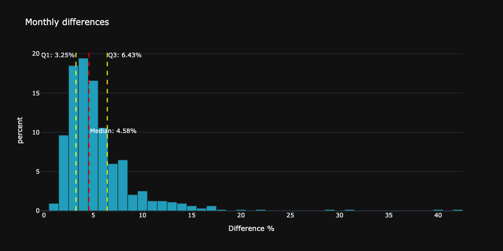

Let`s check the full available time range. We can se what would had happened if we had started the saving plan back to 1972, wiht 10$ per month.

|test|picture|
|---|---|
|||

# Checking multiple periods

## Period 1

## Period 2 

## Period 3

## Period 4

## Period 5

# Check multiple results with the same end date

Check whether day are the same for different periods.

All results seem to be the same.

# Evaluating all possible scenarios with one fix end date

# Compare two different saving plans with the same time period

Using the best day and the worst day

The difference the two days is rather small.

PLotting the distribution of the differences between day 5 and day 30

# Differences between cheapest and most expensive day to invest

# Day rankings

Create dataframe with all possible starting dates

## Creating rank dataframe

I go with the dense ranking method, which assigns the same rank to the same values, but the next value will have a rank that is the next number after the previous rank. 

## Get distribution of the ranks for the first day

using the sum of the ranks, the best day was the first day. To get better insight, we can get the distribution of the first day.

## Get distribution of the ranks for the second day

## Get distribution of ranks for 31th day

# Get distribution of the rank for the 15th day

## Rank statistics
Generic statistics for the ranks.
