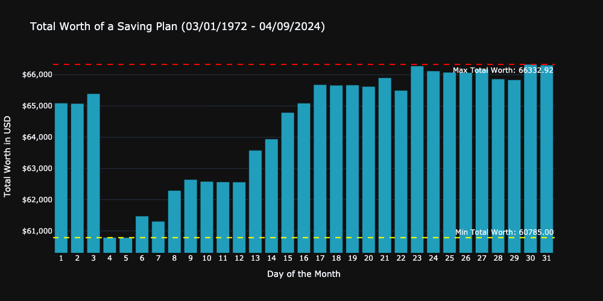
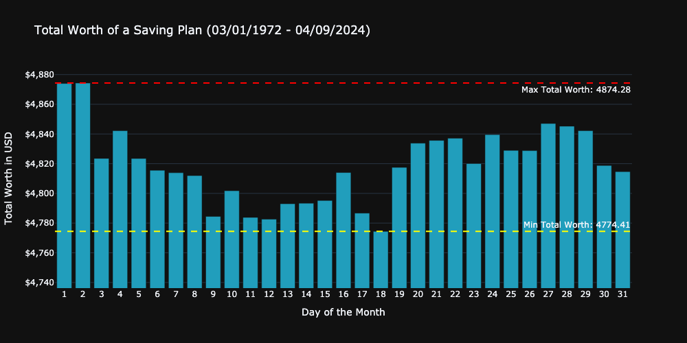
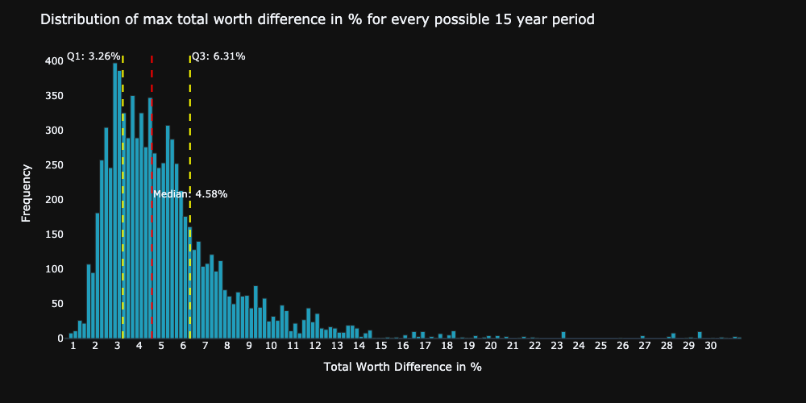

---
author:
  name: "David Meszaros"
date: 2024-09-03
linktitle: bdts
title: Best day to invest
type:
- post
- posts
weight: 10
aliases:
- /blog/best-day-to-invest/
---
# What is the best day of the month to schedule your saving plans ? 

## Inspiration

One day, I checked my ETF savings plan and noticed that the stock price seemed higher on the days when the plan was executed. My intuition suggested that on those days, the price was higher than expected, especially compared to the previous days when it appeared to be lower. Although this perception was rather subjective and I didn’t thoroughly check all the months when my savings plan was executed, it was strange enough to make me curious. I thought it would be interesting to create a project to determine which day is the best to trigger my savings plan.

To check which is the best day to invest, I will analyze the MSCI World Index because it is a well-known and long-established index used by many ETF providers. I wanted to use the most reliable data source, which I believed would be the official MSCI [data](https://www.msci.com/end-of-day-history). However, this site only provides daily data up to 1997, which is not ideal because determining the best day of the month obviously requires daily data 🧐.

I would just skip the story how I finally found the most obvious and easiest data source for my research after many hours of deep diving into the farthest corners of the internet. We can simply use the yfinance library, which I was already familiar with, though I wasn't aware that the Yahoo API provides data on indices. With this library, we're able to retrieve historical daily data for the [MSCI World Index](https://finance.yahoo.com/quote/%5E990100-USD-STRD/history/?filter=history) dating back to the 1970s, the last 50 years, which is quite impressive. 

To work with the data, there were several necessary tasks to be taken. I would highlight one important step where I verify if the selected investment day was available in the dataset.
The assumption, that every calender day can be used between 1 and 31 to schedule the investment plan. The problem is that the selected day is probably not available in every single month, because not every day is a trading day. 
My strategy was to check if the selected day is available, if not I am using the next available day in the given month. However this works perfectly in most cases, but at the end of the month not, because if the selected day is a day which is not followed by a trading day in the same month, the next available day would be in the next month. In this case I am using the last available day in the given month.

# Results

The first simulation I ran was to check the effect of the investment day for the whole dataset which includes data from every day from the last 54 years, I invested 10$ in every month.

The results from the first simulation does not really meets my expectation. As you can see in the [figure](#figure1) the difference between the minimum possible and maximum possible worth is **310$** which means you would have **0.47%** more total worth if you would have invested on the first day of the  month, compared to the last day of the month.

## Last 15 years

The first simulation was carried out on a really long run, which is not realistic for most of us. Let`s take a look on a more lifelike scenario, where we are investing for the last 15 years.

I am very happy now, because the results are more or less covering my personal perception. The first day was not the best day to invest in the last 15 years, but not the worst either. However most of the days are working better than the first one.
The max difference between the best and worst day was **301$** which means if you would invest always either on the 3rd, 4th or 5th day of the month you would have **8.2%** less total worth compared to the best day, which was the last day of the month. These results are basically the opposite of the results from the first simulation. 

## First 15 years

Let`s take a look for the first 15 years of the available data.

In this case, the results are matching the results from the simulation with the full available range. I mean with matching, that the  difference between the best and worst day is exactly the same with **0.47%**. However in this case the best day was the 2st day of the month.

# Multiple time periods

To make the evaluation more robust, I ran the simulation for multiple times with  15 years, or more precise I ran the simulation for every possible 15 years period in the last 52 years. These includes **9723** simulations.

I found the results quite interesting, because the difference can be quite significant. However most of the differences are located between **3-7%**. But in some cases the difference can be more than **10%**.

# Check outliers

